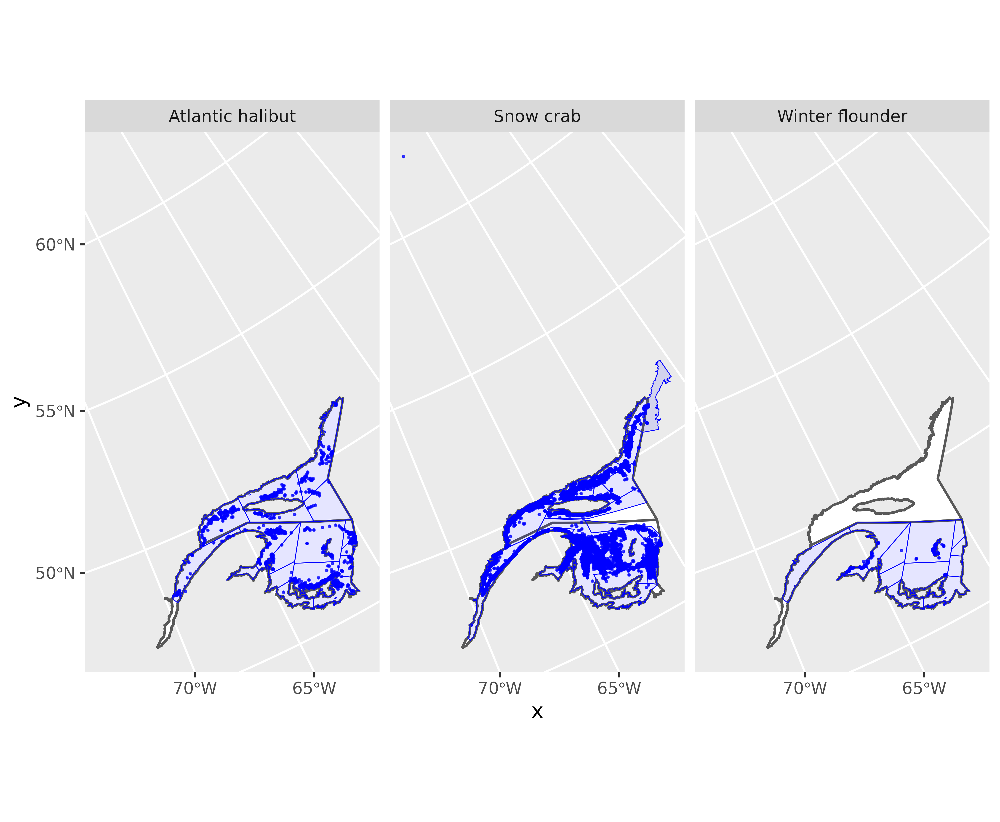
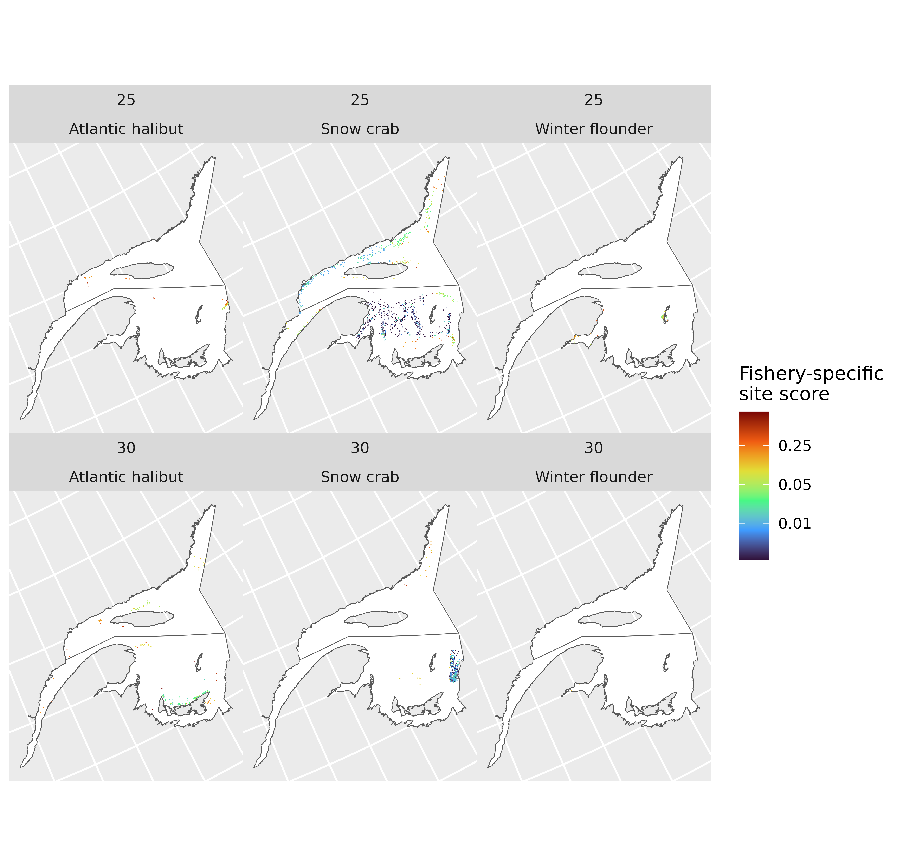

# Site score

## Overview

This vignette provides an overview of the steps to generate
fishery-specific weekly site scores, using a subset of anonymised
landings data. Data have been subjected to quality controls. Each row is
associated with a fishing area (column ‘fa’). Catch amounts have been
removed from the data.

## R packages

Standard R packages are used that are available from CRAN, as well as
some that only available on GitHub.

### CRAN R packages

``` r

library(dplyr)
library(terra)
library(ggplot2)
library(tidyterra)
```

### GitHub R packages

The following packages are all available from
<https://jolenesutton.github.io>.

``` r

library(fisheriescape) 
library(gslSpatial) 
library(eclectic)  
library(swim)
```

## Get landings data and polygon data

### Landings data

``` r


df<-fs.data.anon

names(df)
#>  [1] "fishery"      "event.id"     "trip.id"      "cfv.anon"     "year"        
#>  [6] "dateland"     "ctchdate"     "sw"           "nafodiv"      "depth.gebco" 
#> [11] "x"            "y"            "gear.name"    "gear.amount"  "hours.fished"
#> [16] "days.fished"  "fa"
```

|                  |  2015 | 2016 |
|:-----------------|------:|-----:|
| Atlantic halibut |   856 |  879 |
| Snow crab        | 10688 | 9731 |
| Winter flounder  |   498 |  547 |

Records per year {.table .table .table-striped .table-hover
.table-condensed style="margin-left: auto; margin-right: auto;"}

| fishery | event.id | trip.id | cfv.anon | year | dateland | ctchdate | sw | nafodiv | depth.gebco | x | y | gear.name | gear.amount | hours.fished | days.fished | fa |
|:---|:---|:---|:---|---:|:---|:---|:---|:---|---:|---:|---:|:---|---:|---:|---:|:---|
| Atlantic halibut | ahx319;2015-07-13;2015-07-10;49.49083;-63.851 | ahx319;2015-07-13;2015-07-10 | ahx319 | 2015 | 2015-07-13 | 2015-07-10 | 29 | 4S | -192.0005 | 2244026 | 1586757 | longline | 12 | 6 | 1 | GQ_GFA_4S4 |
| Atlantic halibut | ahx319;2015-07-13;2015-07-11;49.47217;-63.84033 | ahx319;2015-07-13;2015-07-11 | ahx319 | 2015 | 2015-07-13 | 2015-07-11 | 29 | 4S | -213.9925 | 2245667 | 1585274 | longline | 12 | 6 | 1 | GQ_GFA_4S4 |
| Atlantic halibut | ahx149;2015-08-10;2015-08-08;50.043;-59.21133 | ahx149;2015-08-10;2015-08-08 | ahx149 | 2015 | 2015-08-10 | 2015-08-08 | 33 | 4S | -209.9678 | 2505219 | 1804340 | longline | 6 | 6 | 1 | GQ_GFA_4S5 |
| Atlantic halibut | ahx149;2015-08-10;2015-08-09;50.043;-59.21 | ahx149;2015-08-10;2015-08-09 | ahx149 | 2015 | 2015-08-10 | 2015-08-09 | 33 | 4S | -209.9678 | 2505301 | 1804390 | longline | 6 | 12 | 1 | GQ_GFA_4S5 |
| Atlantic halibut | ahx149;2015-08-13;2015-08-12;50.34833;-59.55267 | ahx149;2015-08-13;2015-08-12 | ahx149 | 2015 | 2015-08-13 | 2015-08-12 | 33 | 4S | -127.8552 | 2466770 | 1820762 | longline | 6 | 6 | 1 | GQ_GFA_4S5 |
| Atlantic halibut | ahx149;2015-08-24;2015-08-22;50.26633;-59.586 | ahx149;2015-08-24;2015-08-22 | ahx149 | 2015 | 2015-08-24 | 2015-08-22 | 35 | 4S | -141.9655 | 2469449 | 1811720 | longline | 6 | 4 | 1 | GQ_GFA_4S5 |

head(df) {.table .table
style="width: auto !important; margin-left: auto; margin-right: auto;"}

  
  
Note that there are missing spatial coordinates (columns ‘x’ and ‘y’).
There are also some missing depths, and depths \> 0 m (on land!)

``` r

summary(df$x)
#>    Min. 1st Qu.  Median    Mean 3rd Qu.    Max.     NAs 
#> 1645552 2246327 2363254 2336776 2477321 2597402    1161

summary(df$y)
#>    Min. 1st Qu.  Median    Mean 3rd Qu.    Max.     NAs 
#> 1275679 1409764 1456497 1503025 1577191 2906314    1161

summary(df$depth.gebco)
#>    Min. 1st Qu.  Median    Mean 3rd Qu.    Max.     NAs 
#> -479.01 -111.99  -83.00  -92.08  -69.00  331.95    1162
```

### Fishing area polygons

``` r

fa.poly<-readRDS(system.file('extdata','fa.poly.rds',package='fisheriescape'))
fa.poly<-terra::vect(fa.poly, geom=c("geometry"), crs='ESRI:102001', keepgeom=F)
```

### NAFO polygons

This shapefile is not necessary for estimating site scores, but it is
useful here for plotting. Originally sourced from
<https://www.nafo.int>.

``` r

naf<-readRDS(system.file('extdata','nafo.rds',package='fisheriescape'))
naf<-terra::vect(naf, geom=c("geometry"), crs='ESRI:102001', keepgeom=F)
```

### Plot

Most of the coordinates are inside the fishing area polygons, but some
are outside.

``` r

ggplot()+
  geom_spatvector(data=naf,fill='white',linewidth=0.6)+
  geom_point(data=df,aes(x,y),size=0.2, col='blue',alpha=0.75)+
  geom_spatvector(data=fa.poly,fill='blue',alpha=0.1,col='blue')+
  facet_wrap(~fishery)
```



## Site score

During the site score process, records with coordinates inside the
fishing area polygons will be assigned to a spatial reference grid
according to their coordinates. Records that are missing coordinates,
records with coordinates outside the fishing area polygons, and records
with coordinates at depths \> 0 m will be assigned to a spatial
reference grid according to the [SWIM
framework](https://academic.oup.com/icesjms/article/83/5/fsag070/8687932?login=true).
When applying the SWIM framework, the depths from records with good
quality coordinates will be used to establish sampling weights over the
spatial reference grid. Additional attributes can be incorporated into
the SWIM framework, but for simplicity, we will only use depth in these
examples

### Spatial reference grid

First, we need a spatial reference grid. The one used here is a 10 km²
hexagonal grid from [Koropatnick and Coffen-Smout,
2020](https://gcgeo.gc.ca/geonetwork/metadata/eng/572f6221-4d12-415e-9d5e-984b15d34da4).
The grid has been cropped to the approximate study area extent. Each
grid cell has been assigned its median depth (m) based on [GEBCO
2024](https://www.gebco.net/).

``` r

grid<-readRDS(system.file('extdata','grid.rds',package='fisheriescape'))
grid<-terra::vect(grid, geom=c("geometry"), crs='ESRI:102001', keepgeom=F)

grid
#> class       : SpatVector
#> geometry    : polygons
#> dimensions  : 110676, 6  (geometries, attributes)
#> extent      : 1576378, 3139826, 780168.8, 2239860  (xmin, xmax, ymin, ymax)
#> coord. ref. : Canada_Albers_Equal_Area_Conic (ESRI:102001)
#> names       : OBJECTID  GRID_ID             Subset Shape_Leng Shape_Area depth.med
#> type        :    <num>    <chr>              <chr>      <num>      <num>     <num>
#> values      :   167180 ATT-1312 QC, NL, NB, PE, NS    11771.3      1e+07   350.689
#>                 167181 ATU-1312 QC, NL, NB, PE, NS    11771.3      1e+07   416.052
#>                 167182 ATV-1312 QC, NL, NB, PE, NS    11771.3      1e+07   315.953
#>               ...

names(grid)
#> [1] "OBJECTID"   "GRID_ID"    "Subset"     "Shape_Leng" "Shape_Area"
#> [6] "depth.med"
```

  
  
Next, we need to distinguish records that have good quality coordinates
(i.e., inside fishing area polygons), from those that have erroneous
coordinates (i.e., outside of fishing area polygons or with depths \> 0
m).

``` r

df$to.swim<-'no'
df[which(is.na(df$x)|is.na(df$y)),'to.swim']<-'yes'
df[which(df$depth.gebco>0),'to.swim']<-'yes'
table(df$to.swim,useNA='always')
#> 
#>    no   yes  <NA> 
#> 21952  1247     0

## any points outside fa.poly
unique(df$fishery)
#> [1] "Atlantic halibut" "Snow crab"        "Winter flounder"
unique(fa.poly$fishery)
#> [1] "Atlantic halibut" "Snow crab"        "Winter flounder"

my.list<-list()
fisheries<-unique(fa.poly$fishery)
for(j in 1:length(unique(fisheries))){
  dat<-df[which(df$fishery==fisheries[j]),]
  poly<-fa.poly[which(fa.poly$fishery==fisheries[j]),]
  
  fleets<-sort(unique(dat$fa))
  inner.list<-list()
  for(i in 1:length(fleets)){
    tmp.df<-dat[which(dat$fa==fleets[i]),]
    tmp.poly<-poly[which(poly$fa==fleets[i]),]
    tmp<-terra::vect(tmp.df,geom=c('x','y'),crs=crs(poly))
    tmp$inout<-is.related(tmp, tmp.poly,relation='within')
    inner.list[[i]]<-tmp
  }
 my.list[[j]]<-do.call(rbind,inner.list)
}
```

``` r

pts<-do.call(rbind,my.list)
rm(my.list)
nrow(df)
#> [1] 23199
nrow(pts)
#> [1] 23199
df2<-left_join(df,as.data.frame(pts))
#> Joining with `by = join_by(fishery, event.id, trip.id, cfv.anon, year,
#> dateland, ctchdate, sw, nafodiv, depth.gebco, gear.name, gear.amount,
#> hours.fished, days.fished, fa, to.swim)`
df2[which(df2$inout==FALSE),'to.swim']<-'yes'
table(df2$to.swim,useNA='always')
#> 
#>    no   yes  <NA> 
#> 21892  1307     0
table(df$to.swim,useNA='always')
#> 
#>    no   yes  <NA> 
#> 21952  1247     0
```

### Assign records to the spatial reference grid

Records that have good quality coordinates are assigned to the spatial
reference grid according to their coordinates.

``` r

index<-which(df2$to.swim=='no')

x<-gslSpatial::assign_points_terra(df2[index,'x'],df2[index,'y'],grid[,"GRID_ID"])

df2[index,'GRID_ID']<-x[,3]
```

  
  
Records that have poor quality coordinates are assigned to the spatial
reference grid according to the [SWIM
framework](https://academic.oup.com/icesjms/article/83/5/fsag070/8687932?login=true).
The SWIM framework is applied separately to each fishery and NAFO
division.

``` r

no.swim<-df2[which(df2$to.swim=='no'),]
for.swim<-df2[which(df2$to.swim=='yes'),]
for.swim$GRID_ID<-NA

unique(for.swim$fishery)
#> [1] "Atlantic halibut" "Snow crab"        "Winter flounder"
table(for.swim$nafodiv,for.swim$fishery)
#>     
#>      Atlantic halibut Snow crab Winter flounder
#>   4S               25       110               0
#>   4T              105       947             120

for.swim$fn<-paste(for.swim$fishery,for.swim$gear.name,for.swim$nafodiv,sep='-')
no.swim$fn<-paste(no.swim$fishery,no.swim$gear.name,no.swim$nafodiv,sep='-')

unique(for.swim$fn)
#> [1] "Atlantic halibut-longline-4S" "Atlantic halibut-longline-4T"
#> [3] "Snow crab-trap-4S"            "Snow crab-trap-4T"           
#> [5] "Winter flounder-gillnet-4T"
unique(no.swim$fn)
#> [1] "Atlantic halibut-longline-4S" "Atlantic halibut-longline-4T"
#> [3] "Snow crab-trap-4S"            "Snow crab-trap-4T"           
#> [5] "Winter flounder-gillnet-4T"
```

``` r

my.list<-list()
fisheries<-sort(unique(for.swim$fn))
fisheries
#> [1] "Atlantic halibut-longline-4S" "Atlantic halibut-longline-4T"
#> [3] "Snow crab-trap-4S"            "Snow crab-trap-4T"           
#> [5] "Winter flounder-gillnet-4T"

for(i in 1:length(fisheries)){
  
  FOR.SWIM<-for.swim[which(for.swim$fn==fisheries[i]),]
  
  index<-which(fa.poly$fishery==unlist(strsplit(fisheries[i],"-"))[1])
  poly<-fa.poly[index,]
  grid2<-terra::intersect(grid,poly[,'fa'])
  
  #//////////////////////////////////////////
  ## Depth scores
  # use good quality coordinates to establish depth scores
  tmp<-no.swim[which(no.swim$fn==fisheries[i]),]
  bin.width=10
  bins<-eclectic::bin_variable(abs(tmp$depth.gebco),bin.width)
  bins[,2]<-as.numeric(bins[,2])
  tmp[,c('bin' ,'bin.midpt')]<-bins[,1:2]
  bins<-distinct(bins)
  bins<-bins[order(bins$bin.midpt),]
  df.hist<-tmp|>
    group_by(bin.midpt=as.numeric(bin.midpt))|>
    summarise(count=n())|>
    mutate(prob.depth=count/sum(count))

  grid3<-grid2[which(grid2$depth.med<=0),]
  grid3$depth<-abs(grid3$depth.med)
  grid3$bin.midpt<-NA
  grid.bins<-seq(bins[1,'bin.midpt']-(bin.width/2),max(grid3$depth),by=bin.width)
  
  for(j in 1:length(grid.bins)){
    start<-grid.bins[j]
    stop<-grid.bins[j]+bin.width
    bin.midpt<-(start+stop)/2
    grid3[which(grid3$depth>=start&grid3$depth<stop),'bin.midpt']<-bin.midpt
  }

  grid4<-left_join(grid3,df.hist[,c(1,3)])
  grid4<-grid4[,-which(names(grid4)=='bin.midpt')]
  index<-which(is.na(grid4$prob.depth))
  if(length(index)>0){
    grid4[index,'prob.depth']<-0
  }
  grid4$prob<-grid4$prob.depth
  grid4<-grid4[,-which(names(grid4)=='depth.med')]
  dim(grid4)
  
  #//////////////////////////////////////////
  ## Use depth scores as sampling weights
  SWIM.KEYS<-sort(unique(FOR.SWIM$fa))
  SWIM.KEYS%in%unique(grid4$fa)

  for(p in 1:length(SWIM.KEYS)){
      INDEX<-which(FOR.SWIM$fa==SWIM.KEYS[p])
      WGHTS<-as.data.frame(grid4[which(grid4$fa==SWIM.KEYS[p]),c('GRID_ID','prob')])
      WGHTS[which(is.na(WGHTS[,2])),2]<-0
      set.seed(123)
      FOR.SWIM[INDEX,'GRID_ID']<-swim::sw_sample(nrow(FOR.SWIM[INDEX,]),WGHTS,option=1)
  }
  
  my.list[[i]]<-FOR.SWIM
  }
```

``` r

for.swim2<-bind_rows(my.list)
length(which(is.na(for.swim2$GRID_ID))) #should be zero because all records should be associated with a spatial grid cell
#> [1] 0

results<-bind_rows(no.swim,for.swim2)
head(results)
#>            fishery                                        event.id
#> 1 Atlantic halibut   ahx319;2015-07-13;2015-07-10;49.49083;-63.851
#> 2 Atlantic halibut ahx319;2015-07-13;2015-07-11;49.47217;-63.84033
#> 3 Atlantic halibut   ahx149;2015-08-10;2015-08-08;50.043;-59.21133
#> 4 Atlantic halibut      ahx149;2015-08-10;2015-08-09;50.043;-59.21
#> 5 Atlantic halibut ahx149;2015-08-13;2015-08-12;50.34833;-59.55267
#> 6 Atlantic halibut   ahx149;2015-08-24;2015-08-22;50.26633;-59.586
#>                        trip.id cfv.anon year   dateland   ctchdate sw nafodiv
#> 1 ahx319;2015-07-13;2015-07-10   ahx319 2015 2015-07-13 2015-07-10 29      4S
#> 2 ahx319;2015-07-13;2015-07-11   ahx319 2015 2015-07-13 2015-07-11 29      4S
#> 3 ahx149;2015-08-10;2015-08-08   ahx149 2015 2015-08-10 2015-08-08 33      4S
#> 4 ahx149;2015-08-10;2015-08-09   ahx149 2015 2015-08-10 2015-08-09 33      4S
#> 5 ahx149;2015-08-13;2015-08-12   ahx149 2015 2015-08-13 2015-08-12 33      4S
#> 6 ahx149;2015-08-24;2015-08-22   ahx149 2015 2015-08-24 2015-08-22 35      4S
#>   depth.gebco       x       y gear.name gear.amount hours.fished days.fished
#> 1   -192.0005 2244026 1586757  longline          12            6           1
#> 2   -213.9925 2245667 1585274  longline          12            6           1
#> 3   -209.9678 2505219 1804340  longline           6            6           1
#> 4   -209.9678 2505301 1804390  longline           6           12           1
#> 5   -127.8552 2466770 1820762  longline           6            6           1
#> 6   -141.9655 2469449 1811720  longline           6            4           1
#>           fa to.swim inout  GRID_ID                           fn
#> 1 GQ_GFA_4S4      no  TRUE AYB-1075 Atlantic halibut-longline-4S
#> 2 GQ_GFA_4S4      no  TRUE AYC-1075 Atlantic halibut-longline-4S
#> 3 GQ_GFA_4S5      no  TRUE BBM-1011 Atlantic halibut-longline-4S
#> 4 GQ_GFA_4S5      no  TRUE BBM-1011 Atlantic halibut-longline-4S
#> 5 GQ_GFA_4S5      no  TRUE BAZ-1006 Atlantic halibut-longline-4S
#> 6 GQ_GFA_4S5      no  TRUE BBA-1008 Atlantic halibut-longline-4S
```

### Calculate site scores from the number of records in each spatial grid cell

**Counts.** For each fishery, count the number of records per week per
year.

``` r

counts<-results|>
    dplyr::group_by(fishery,gear.name,fa,year,sw,GRID_ID)|>
    dplyr::summarise(count = dplyr::n())
#> `summarise()` has regrouped the output.
#> ℹ Summaries were computed grouped by fishery, gear.name, fa, year, sw, and
#>   GRID_ID.
#> ℹ Output is grouped by fishery, gear.name, fa, year, and sw.
#> ℹ Use `summarise(.groups = "drop_last")` to silence this message.
#> ℹ Use `summarise(.by = c(fishery, gear.name, fa, year, sw, GRID_ID))` for
#>   per-operation grouping (`?dplyr::dplyr_by`) instead.

head(counts)
#> # A tibble: 6 × 7
#> # Groups:   fishery, gear.name, fa, year, sw [1]
#>   fishery          gear.name fa          year sw    GRID_ID  count
#>   <chr>            <chr>     <chr>      <dbl> <chr> <chr>    <int>
#> 1 Atlantic halibut longline  GQ_GFA_4S1  2015 19    AVH-1093     2
#> 2 Atlantic halibut longline  GQ_GFA_4S1  2015 19    AVH-1094     1
#> 3 Atlantic halibut longline  GQ_GFA_4S1  2015 19    AVU-1079     4
#> 4 Atlantic halibut longline  GQ_GFA_4S1  2015 19    AVV-1079     1
#> 5 Atlantic halibut longline  GQ_GFA_4S1  2015 19    AVV-1081     1
#> 6 Atlantic halibut longline  GQ_GFA_4S1  2015 19    AVX-1081     1
```

  
  
**Site score.** Standardize the counts such that the values for each
fishing area and week sum to 1. Remember to save this file for the
fisheriescape calculations.

``` r

site.score<-counts|>
    dplyr::group_by(fishery,gear.name,fa,year,sw)|>
    dplyr::mutate(sum.count.fa.yr.sw=sum(count),
                  ss=count/sum.count.fa.yr.sw)

head(site.score)
#> # A tibble: 6 × 9
#> # Groups:   fishery, gear.name, fa, year, sw [1]
#>   fishery     gear.name fa     year sw    GRID_ID count sum.count.fa.yr.sw    ss
#>   <chr>       <chr>     <chr> <dbl> <chr> <chr>   <int>              <int> <dbl>
#> 1 Atlantic h… longline  GQ_G…  2015 19    AVH-10…     2                 10   0.2
#> 2 Atlantic h… longline  GQ_G…  2015 19    AVH-10…     1                 10   0.1
#> 3 Atlantic h… longline  GQ_G…  2015 19    AVU-10…     4                 10   0.4
#> 4 Atlantic h… longline  GQ_G…  2015 19    AVV-10…     1                 10   0.1
#> 5 Atlantic h… longline  GQ_G…  2015 19    AVV-10…     1                 10   0.1
#> 6 Atlantic h… longline  GQ_G…  2015 19    AVX-10…     1                 10   0.1
summary(site.score)
#>       fishery          gear.name             fa             year     
#>  Length   :15311   Length   :15311   Length   :15311   Min.   :2015  
#>  N.unique :    3   N.unique :    3   N.unique :   33   1st Qu.:2015  
#>  N.blank  :    0   N.blank  :    0   N.blank  :    0   Median :2015  
#>  Min.nchar:    9   Min.nchar:    4   Min.nchar:    9   Mean   :2015  
#>  Max.nchar:   16   Max.nchar:    8   Max.nchar:   11   3rd Qu.:2016  
#>                                                        Max.   :2016  
#>          sw             GRID_ID          count        sum.count.fa.yr.sw
#>  Length   :15311   Length   :15311   Min.   : 1.000   Min.   :  1.0     
#>  N.unique :   34   N.unique : 4862   1st Qu.: 1.000   1st Qu.: 34.0     
#>  N.blank  :    0   N.blank  :    0   Median : 1.000   Median :167.0     
#>  Min.nchar:    2   Min.nchar:    7   Mean   : 1.515   Mean   :284.2     
#>  Max.nchar:    2   Max.nchar:    8   3rd Qu.: 2.000   3rd Qu.:562.0     
#>                                      Max.   :15.000   Max.   :744.0     
#>        ss          
#>  Min.   :0.001344  
#>  1st Qu.:0.002688  
#>  Median :0.007463  
#>  Mean   :0.044347  
#>  3rd Qu.:0.037037  
#>  Max.   :1.000000
```

## Plot results

For simplicity, plot just certain weeks.

``` r

weeks<-c(25,30)
plot.grid<-right_join(grid,site.score[which(site.score$sw%in%weeks),])
#> Joining with `by = join_by(GRID_ID)`


ggplot()+
  geom_spatvector(data=naf,fill='white')+
  geom_spatvector(data=plot.grid,aes(fill=ss),col=NA)+
  facet_wrap(~sw+fishery)+
  scale_fill_viridis_c(name='Fishery-specific\nsite score',
         option='turbo',
         trans = scales::pseudo_log_trans(sigma = 0.001),
         breaks=c(0.01,0.05,0.25))+
  theme(panel.spacing = unit(0, "pt"),
        axis.text = element_blank(),
        axis.ticks = element_blank())
```


